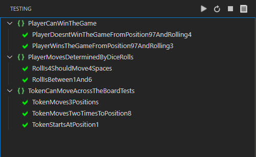
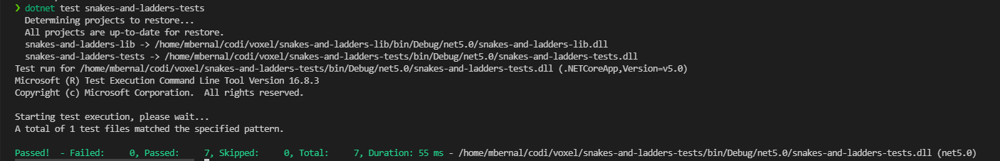

# Snakes and Ladders - Voxel Interview Kata

## Overview 

Class library for the three user stories of the Voxel's task and a xUnit tests project.

Three tests files are created based on the three user stories, and they should look like this:

## Requirements

- .NET Core 5

## Restore dependencies

`dotnet restore snakes-and-ladders-lib`
`dotnet restore snakes-and-ladders-tests`

## Run tests

On root folder run: `dotnet test snakes-and-ladders-tests`

If everything works as expected, we should see something like this: 

To see more verbose on the tests results, add `-v=n`

